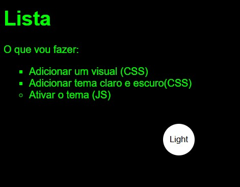
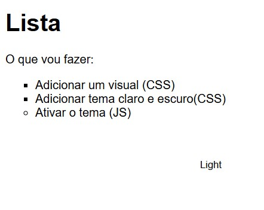

# Site-simples-com-Tema-JS

Curso Básico HTML, CSS E JS- Fundação Bradesco
25 de maio de 2022 - Disponível em : <https://www.ev.org.br/>
Feito: Vanessa Favero - GitHub : <https://github.com/vanixfm>

Código de Autenticidade: 8974F776-D831-437C-B901-7F6444606453

<h2 align="center"> Telas de apresentação </h2>

#html #css  #programação #desenvolvimentoweb
